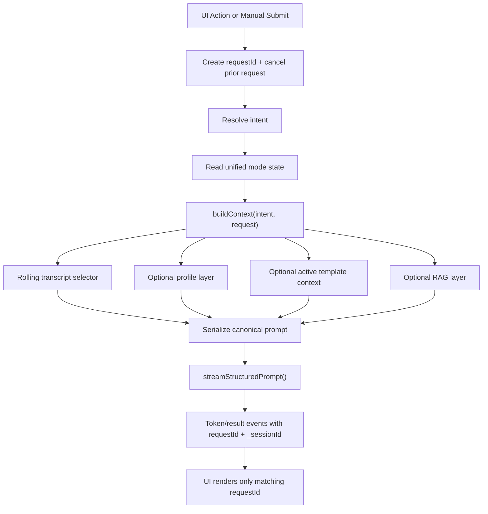

# Assistant Pipeline Audit

## 1. System Overview

The current assistant has two overlapping execution families:

1. Unified quick-action pipeline
   - UI quick buttons call `runAction()` in the overlay: [src/components/NativelyInterface.tsx](/Users/tarunshetty/Desktop/teamsync-cluely-ai-assistant/src/components/NativelyInterface.tsx:1183)
   - IPC routes through `generate-action`: [electron/ipcHandlers.ts](/Users/tarunshetty/Desktop/teamsync-cluely-ai-assistant/electron/ipcHandlers.ts:2529)
   - Backend uses `IntelligenceManager.handleAction()` -> `IntelligenceEngine.runAction()`: [electron/IntelligenceManager.ts](/Users/tarunshetty/Desktop/teamsync-cluely-ai-assistant/electron/IntelligenceManager.ts:184), [electron/IntelligenceEngine.ts](/Users/tarunshetty/Desktop/teamsync-cluely-ai-assistant/electron/IntelligenceEngine.ts:214)
   - Context is built by `ActionContextBuilder`: [electron/ActionContextBuilder.ts](/Users/tarunshetty/Desktop/teamsync-cluely-ai-assistant/electron/ActionContextBuilder.ts:453)
   - Streaming uses `LLMHelper.streamChat()` through the structured wrapper `streamStructuredPrompt()`: [electron/LLMHelper.ts](/Users/tarunshetty/Desktop/teamsync-cluely-ai-assistant/electron/LLMHelper.ts:2807)

2. Legacy ad hoc paths
   - `runWhatShouldISay`, `runClarify`, `runRecap`, `runFollowUpQuestions`, `runAnswerNow`, `streamGeminiChat`, live RAG chat, code hint, screen scan
   - These still build prompt/context differently from the unified quick-action path

The six quick buttons now use the unified path, but manual chat and several legacy RPCs still bypass it. That is the main reason the system can feel inconsistent even when the UI looks uniform.

## 2. Button Flow Mapping

| Button | UI handler | IPC | Backend entry | Prompt builder | LLM call |
|---|---|---|---|---|---|
| What to Answer | `handleWhatToSay()` | `generate-action` | `handleAction('what_to_answer')` | `buildContext()` | `streamStructuredPrompt()` |
| Recap | `handleRecap()` | `generate-action` | `handleAction('recap')` | `buildContext()` | `streamStructuredPrompt()` |
| Clarify | `handleClarify()` | `generate-action` | `handleAction('clarify')` | `buildContext()` | `streamStructuredPrompt()` |
| Brainstorm | `handleBrainstorm()` | `generate-action` | `handleAction('brainstorm')` | `buildContext()` | `streamStructuredPrompt()` |
| Follow Up | `handleFollowUpQuestions()` | `generate-action` | `handleAction('follow_up_questions')` | `buildContext()` | `streamStructuredPrompt()` |
| Answer | `handleAnswerNow()` when recording stops | `generate-action` | `handleAction('answer_now')` | `buildContext()` | `streamStructuredPrompt()` |

Verified handlers:

- Quick action start/cancel logic: [src/components/NativelyInterface.tsx](/Users/tarunshetty/Desktop/teamsync-cluely-ai-assistant/src/components/NativelyInterface.tsx:1130)
- What to Answer / Recap / Clarify / Brainstorm / Follow Up: [src/components/NativelyInterface.tsx](/Users/tarunshetty/Desktop/teamsync-cluely-ai-assistant/src/components/NativelyInterface.tsx:2049)
- Answer button: [src/components/NativelyInterface.tsx](/Users/tarunshetty/Desktop/teamsync-cluely-ai-assistant/src/components/NativelyInterface.tsx:2577)

Important caveat:

- The quick button labeled `Follow Up` is not the refinement pipeline. It triggers `follow_up_questions`, not `runFollowUp()`: [src/components/NativelyInterface.tsx](/Users/tarunshetty/Desktop/teamsync-cluely-ai-assistant/src/components/NativelyInterface.tsx:2115)

## 3. Prompt Reconstruction

These are the exact code-level prompt shapes for the six buttons. Dynamic values come from live transcript, current session mode, active template mode, profile intelligence, and custom context.

Provider packaging:

- In the unified action path, `serializePromptObject()` constructs the semantic prompt: [electron/ActionContextBuilder.ts](/Users/tarunshetty/Desktop/teamsync-cluely-ai-assistant/electron/ActionContextBuilder.ts:506)
- `LLMHelper.streamChat()` then sends:
  - `systemPrompt = finalSystemPrompt`
  - `userContent = USER QUESTION + CONTEXT`
  - For Groq/Gemini fallback paths this is effectively `finalSystemPrompt + "\n\n" + userContent`: [electron/LLMHelper.ts](/Users/tarunshetty/Desktop/teamsync-cluely-ai-assistant/electron/LLMHelper.ts:2628)

### BUTTON: What to Answer

```text
[SYSTEM PROMPT]
## INTENT
{UNIVERSAL_WHAT_TO_ANSWER_PROMPT}

## OUTPUT CONTRACT
Return a strong next answer for the user.
Start with one direct answer sentence.
Then provide 2 to 4 short bullets the user can speak from.
Use first person when appropriate.
Keep it concise, natural, and ready to say aloud.
{mode-aware rules for behavioral/coding/system_design/follow_up/general}

## SESSION MODE
{one of:
- Treat this as a behavioral interview...
- Treat this as a coding interview...
- Treat this as an ongoing follow-up discussion...
- Treat this as a system design discussion...
- Treat this as a general interview conversation...}

## ACTIVE MODE CONTEXT
{mode.customContext + reference files from ModesManager, if an active template mode exists}

## ACTIVE MODE
{deduped template suffix when active template mode != general}

## PROFILE INTELLIGENCE
{knowledgeOrchestrator.systemPromptInjection if knowledge mode is on and profile preference resolves to force_on}

[CONTEXT]
[PROFILE INTELLIGENCE]
{knowledgeOrchestrator.contextBlock if returned}

[TRANSCRIPT]
{rolling transcript, 180s window, max 18 items, interim interviewer included, 1600-token cap}

[USER QUESTION]
{explicit message if passed, else latest interviewer turn, else mode fallback}
```

Sources:

- Intent prompt and output contract: [electron/ActionContextBuilder.ts](/Users/tarunshetty/Desktop/teamsync-cluely-ai-assistant/electron/ActionContextBuilder.ts:437)
- Transcript strategy: [electron/ActionContextBuilder.ts](/Users/tarunshetty/Desktop/teamsync-cluely-ai-assistant/electron/ActionContextBuilder.ts:246)
- Session mode and active mode blocks: [electron/ActionContextBuilder.ts](/Users/tarunshetty/Desktop/teamsync-cluely-ai-assistant/electron/ActionContextBuilder.ts:267)
- Profile injection: [electron/ActionContextBuilder.ts](/Users/tarunshetty/Desktop/teamsync-cluely-ai-assistant/electron/ActionContextBuilder.ts:290)

### BUTTON: Recap

```text
[SYSTEM PROMPT]
## INTENT
{UNIVERSAL_RECAP_PROMPT}

## OUTPUT CONTRACT
Return bullet summary only.
Use 3 to 6 bullets.
Each bullet must begin with "- ".
No intro sentence.
No conclusion.
{system-design recap rule if sessionMode == system_design}

## SESSION MODE
{session mode directive}

## ACTIVE MODE CONTEXT
{mode.customContext + reference files if active}

## ACTIVE MODE
{deduped template suffix if active template mode != general}

[CONTEXT]
[TRANSCRIPT]
{capped full transcript with epoch summaries, 2800-token cap}

[USER QUESTION]
Summarize the latest discussion.
```

Profile intelligence is intentionally disabled for recap by `INTENT_PROFILE_MAP.recap = never`: [electron/ActionContextBuilder.ts](/Users/tarunshetty/Desktop/teamsync-cluely-ai-assistant/electron/ActionContextBuilder.ts:108)

### BUTTON: Clarify

```text
[SYSTEM PROMPT]
## INTENT
{CLARIFY_MODE_PROMPT}

## OUTPUT CONTRACT
Return exactly one clarifying question.
No bullets.
No explanation.
No prefacing text.
End with a question mark.

## SESSION MODE
{session mode directive}

## ACTIVE MODE CONTEXT
{mode.customContext + reference files if active}

## ACTIVE MODE
{deduped template suffix if active template mode != general}

[CONTEXT]
[TRANSCRIPT]
{rolling transcript, 240s window, max 18 items, interim interviewer included, 1600-token cap}

[USER QUESTION]
{latest interviewer turn or fallback: "Ask one clarifying question that would unblock the current discussion."}
```

Profile intelligence is disabled for clarify: [electron/ActionContextBuilder.ts](/Users/tarunshetty/Desktop/teamsync-cluely-ai-assistant/electron/ActionContextBuilder.ts:108)

### BUTTON: Brainstorm

```text
[SYSTEM PROMPT]
## INTENT
{BRAINSTORM_MODE_PROMPT}

## OUTPUT CONTRACT
Return 3 to 5 distinct approaches.
Each bullet must begin with "- ".
Each bullet must include both the approach and its main tradeoff.
Keep each bullet concise and decision-oriented.
{system-design brainstorm rules if sessionMode == system_design}

## SESSION MODE
{session mode directive}

## ACTIVE MODE CONTEXT
{mode.customContext + reference files if active}

## ACTIVE MODE
{deduped template suffix if active template mode != general}

[CONTEXT]
[TRANSCRIPT]
{rolling transcript, 180s window, max 18 items, interim interviewer included, 1600-token cap}

[USER QUESTION]
{latest interviewer turn or fallback: "Brainstorm the strongest approaches for the latest problem or question."}
```

By default, brainstorm does not use profile intelligence even though policy is `optional`, because the default profile preference for this intent is `force_off`: [electron/ActionContextBuilder.ts](/Users/tarunshetty/Desktop/teamsync-cluely-ai-assistant/electron/ActionContextBuilder.ts:117)

### BUTTON: Follow Up

```text
[SYSTEM PROMPT]
## INTENT
{UNIVERSAL_FOLLOW_UP_QUESTIONS_PROMPT}

## OUTPUT CONTRACT
Return 3 to 5 smart follow-up questions as bullets only.
Each bullet must begin with "- " and contain exactly one question.
No explanation.
No commentary outside the list.

## SESSION MODE
{session mode directive}

## ACTIVE MODE CONTEXT
{mode.customContext + reference files if active}

## ACTIVE MODE
{deduped template suffix if active template mode != general}

[CONTEXT]
[TRANSCRIPT]
{rolling transcript, 180s window, max 18 items, interim interviewer included, 1600-token cap}

[USER QUESTION]
{latest interviewer turn or fallback: "Suggest the best follow-up questions to ask next."}
```

This button does not use the separate answer-refinement path.

### BUTTON: Answer

```text
[SYSTEM PROMPT]
## INTENT
{UNIVERSAL_ANSWER_PROMPT}

## OUTPUT CONTRACT
Return a structured answer the user can say immediately.
Start with one direct opening sentence.
Then provide 2 to 4 short bullets with concrete supporting points.
End with one concise closing sentence.
Use first person when answering for the user.
{mode-aware rules}

## SESSION MODE
{session mode directive}

## ACTIVE MODE CONTEXT
{mode.customContext + reference files if active}

## ACTIVE MODE
{deduped template suffix if active template mode != general}

## PROFILE INTELLIGENCE
{knowledgeOrchestrator.systemPromptInjection if knowledge mode is on}

[CONTEXT]
[PROFILE INTELLIGENCE]
{knowledgeOrchestrator.contextBlock if returned}

[TRANSCRIPT]
{rolling transcript, 180s window, max 18 items, interim interviewer included, 1600-token cap}

[USER QUESTION]
{the finalized mic transcript captured when recording stops}
```

Verified Answer handler:

- UI converts captured mic transcript into `message`: [src/components/NativelyInterface.tsx](/Users/tarunshetty/Desktop/teamsync-cluely-ai-assistant/src/components/NativelyInterface.tsx:2592)
- Backend stores it as a user turn before generation: [electron/IntelligenceEngine.ts](/Users/tarunshetty/Desktop/teamsync-cluely-ai-assistant/electron/IntelligenceEngine.ts:258)

## 4. Context Injection Analysis

### Resume and JD

- Resume/JD enter the unified action path only through `KnowledgeOrchestrator.processQuestion()`: [premium/electron/knowledge/KnowledgeOrchestrator.ts](/Users/tarunshetty/Desktop/teamsync-cluely-ai-assistant/premium/electron/knowledge/KnowledgeOrchestrator.ts:846)
- They are not globally injected for every action.
- `what_to_answer` and `answer_now` default to `force_on`.
- `brainstorm` defaults to `force_off`.
- `recap`, `clarify`, and `follow_up_questions` are hard-disabled.

### Custom Context

- Active template-mode custom context and reference files are injected by `ModesManager.buildActiveModeContextBlock()`: [electron/services/ModesManager.ts](/Users/tarunshetty/Desktop/teamsync-cluely-ai-assistant/electron/services/ModesManager.ts:360)
- Free-form profile custom notes are appended by `KnowledgeOrchestrator` when knowledge mode is on: [premium/electron/knowledge/KnowledgeOrchestrator.ts](/Users/tarunshetty/Desktop/teamsync-cluely-ai-assistant/premium/electron/knowledge/KnowledgeOrchestrator.ts:1079)
- Free-form custom notes are also appended by `LLMHelper.streamChat()` for generic streams: [electron/LLMHelper.ts](/Users/tarunshetty/Desktop/teamsync-cluely-ai-assistant/electron/LLMHelper.ts:2618)

### Duplication / conflicts

Before the patch in this audit:

1. Profile-aware quick actions could inject custom notes twice.
   - Once in `KnowledgeOrchestrator.contextBlock`
   - Again in `LLMHelper` as `<user_context>`

2. Active template mode context entered through different channels depending on the path.
   - Unified quick actions: system prompt instruction block
   - Legacy `streamChat` callers: user context block plus mode suffix

3. Resume/JD behavior differs by button because the policy map is intent-driven, not pipeline-wide.

## 5. Mode System Analysis

There are two independent mode systems:

1. Session mode
   - Stored in `SessionTracker.sessionMode`: [electron/SessionTracker.ts](/Users/tarunshetty/Desktop/teamsync-cluely-ai-assistant/electron/SessionTracker.ts:396)
   - Values: `behavioral | coding | follow_up | general | system_design`
   - Read/written via IPC: [electron/ipcHandlers.ts](/Users/tarunshetty/Desktop/teamsync-cluely-ai-assistant/electron/ipcHandlers.ts:2515)
   - UI mirror: [src/components/NativelyInterface.tsx](/Users/tarunshetty/Desktop/teamsync-cluely-ai-assistant/src/components/NativelyInterface.tsx:632), [src/components/NativelyInterface.tsx](/Users/tarunshetty/Desktop/teamsync-cluely-ai-assistant/src/components/NativelyInterface.tsx:3946)

2. Active template mode
   - Stored in the database through `ModesManager`
   - Values: `general | looking-for-work | sales | recruiting | team-meet | lecture | technical-interview`
   - Provides prompt suffix + custom context/reference files: [electron/services/ModesManager.ts](/Users/tarunshetty/Desktop/teamsync-cluely-ai-assistant/electron/services/ModesManager.ts:337)

Mismatch:

- Both affect the same prompt, but they represent different concepts and live in different stores.
- Nothing guarantees the session mode and active template mode align semantically.
- Example: `sessionMode = system_design` can coexist with active template `sales`.

## 6. Session Analysis

### What is session-scoped

- STT transcript ingestion is guarded by `_sessionId`: [electron/main.ts](/Users/tarunshetty/Desktop/teamsync-cluely-ai-assistant/electron/main.ts:1129), [electron/SessionTracker.ts](/Users/tarunshetty/Desktop/teamsync-cluely-ai-assistant/electron/SessionTracker.ts:205)
- Starting a meeting resets the intelligence session and broadcasts the new session ID to the UI: [electron/main.ts](/Users/tarunshetty/Desktop/teamsync-cluely-ai-assistant/electron/main.ts:1835), [electron/main.ts](/Users/tarunshetty/Desktop/teamsync-cluely-ai-assistant/electron/main.ts:1900)
- Renderer drops stale events using `_sessionId`: [electron/main.ts](/Users/tarunshetty/Desktop/teamsync-cluely-ai-assistant/electron/main.ts:2069)

### Manual inputs

- Quick-action Answer stores the finalized mic transcript as a user message inside `runAction()`: [electron/IntelligenceEngine.ts](/Users/tarunshetty/Desktop/teamsync-cluely-ai-assistant/electron/IntelligenceEngine.ts:258)
- Manual text chat uses a different path and stores the user message in `gemini-chat-stream`: [electron/ipcHandlers.ts](/Users/tarunshetty/Desktop/teamsync-cluely-ai-assistant/electron/ipcHandlers.ts:661)

### Inconsistencies

1. Assistant/manual chat history is session-consistent, but not pipeline-consistent.
2. `addAssistantMessage()` filters short answers under 10 characters, so very short valid outputs are discarded from session state: [electron/SessionTracker.ts](/Users/tarunshetty/Desktop/teamsync-cluely-ai-assistant/electron/SessionTracker.ts:282)
3. `recap` and `follow_up_questions` are intentionally not tracked as the last assistant answer in the unified path, while legacy paths have their own behavior: [electron/IntelligenceEngine.ts](/Users/tarunshetty/Desktop/teamsync-cluely-ai-assistant/electron/IntelligenceEngine.ts:767)

## 7. RAG Analysis

RAG is real, but it is not part of the six-button quick-action pipeline.

### Where RAG exists

- Meeting ingestion / chunking / embeddings: [electron/rag/RAGManager.ts](/Users/tarunshetty/Desktop/teamsync-cluely-ai-assistant/electron/rag/RAGManager.ts:99)
- Retrieval: [electron/rag/RAGRetriever.ts](/Users/tarunshetty/Desktop/teamsync-cluely-ai-assistant/electron/rag/RAGRetriever.ts:54)
- Live JIT indexing: [electron/main.ts](/Users/tarunshetty/Desktop/teamsync-cluely-ai-assistant/electron/main.ts:1940)

### Where RAG is used

- Manual live meeting chat preflights through `rag:query-live`: [src/components/NativelyInterface.tsx](/Users/tarunshetty/Desktop/teamsync-cluely-ai-assistant/src/components/NativelyInterface.tsx:2681)
- IPC RAG handlers stream `rag:stream-chunk`: [electron/ipcHandlers.ts](/Users/tarunshetty/Desktop/teamsync-cluely-ai-assistant/electron/ipcHandlers.ts:2943)

### Where RAG is not used

- What to Answer
- Recap
- Clarify
- Brainstorm
- Follow Up Questions
- Answer

So vector memory is a parallel chat feature, not a universal context layer.

## 8. Root Cause Summary

The pipeline feels inconsistent for four concrete reasons:

1. The repo has multiple prompt builders.
   - Unified action builder
   - Legacy `WhatToAnswerLLM`
   - Legacy `runAnswerNow`
   - Manual `streamGeminiChat`
   - RAG chat prompt builder

2. The repo has multiple context sources injected in different places.
   - Session transcript
   - Active template-mode context
   - Resume/JD profile context
   - Custom notes
   - RAG chunks

3. The repo has two independent mode systems.
   - Session mode
   - Active template mode

4. The six quick actions are unified, but manual chat and several legacy handlers still bypass the unified path.

## 9. Refactored Architecture Diagram



## 10. New Unified Prompt Template

```text
[SYSTEM PROMPT]
## INTENT
{intent prompt}

## OUTPUT CONTRACT
{output contract}

## SESSION MODE
{session mode directive}

## ACTIVE MODE CONTEXT
{active template customContext + reference files, if any}

## ACTIVE MODE
{active template suffix, if any}

## PROFILE INTELLIGENCE
{optional profile system prompt injection}

## RAG INSTRUCTIONS
{optional RAG instruction block}

[CONTEXT]
[PROFILE]
{optional profile context}

[RAG]
{optional retrieved chunks}

[TRANSCRIPT]
{selected transcript window}

[USER QUESTION]
{resolved question}
```

Rules:

- One builder
- One serializer
- One streaming wrapper
- One requestId model
- Optional layers only, never ad hoc prompt fragments in handlers

## 11. Code Implementation

I implemented the first consolidation step directly in code:

1. Canonical `buildContext()`
   - Added as a wrapper over `buildContextLayers()` + `serializePromptObject()`: [electron/ActionContextBuilder.ts](/Users/tarunshetty/Desktop/teamsync-cluely-ai-assistant/electron/ActionContextBuilder.ts:498)

2. Canonical `handleAction()`
   - Added to `IntelligenceManager` so callers use an intent-first API: [electron/IntelligenceManager.ts](/Users/tarunshetty/Desktop/teamsync-cluely-ai-assistant/electron/IntelligenceManager.ts:184)

3. Canonical stream wrapper
   - Added `LLMHelper.streamStructuredPrompt()` and wired the unified action engine to it: [electron/LLMHelper.ts](/Users/tarunshetty/Desktop/teamsync-cluely-ai-assistant/electron/LLMHelper.ts:2807), [electron/IntelligenceEngine.ts](/Users/tarunshetty/Desktop/teamsync-cluely-ai-assistant/electron/IntelligenceEngine.ts:570)

4. RequestId + abort path
   - UI cancellation and request ownership are already centralized here: [src/components/NativelyInterface.tsx](/Users/tarunshetty/Desktop/teamsync-cluely-ai-assistant/src/components/NativelyInterface.tsx:1130)
   - Backend per-request cancellation is here: [electron/ipcHandlers.ts](/Users/tarunshetty/Desktop/teamsync-cluely-ai-assistant/electron/ipcHandlers.ts:637), [electron/IntelligenceEngine.ts](/Users/tarunshetty/Desktop/teamsync-cluely-ai-assistant/electron/IntelligenceEngine.ts:447)

5. Duplicate custom-context fix
   - Added `skipCustomNotesInjection` to the structured action stream path so profile-aware quick actions do not inject the same custom notes twice: [electron/LLMHelper.ts](/Users/tarunshetty/Desktop/teamsync-cluely-ai-assistant/electron/LLMHelper.ts:2403), [electron/LLMHelper.ts](/Users/tarunshetty/Desktop/teamsync-cluely-ai-assistant/electron/LLMHelper.ts:2620), [electron/IntelligenceEngine.ts](/Users/tarunshetty/Desktop/teamsync-cluely-ai-assistant/electron/IntelligenceEngine.ts:333)

Recommended next refactor:

1. Move manual text chat off `streamGeminiChat` and onto `handleAction('answer_now')` plus an optional `ragLayer`.
2. Collapse session mode and active template mode into a single resolved prompt-mode object.
3. Make RAG an optional layer inside `buildContext()` instead of a separate chat subsystem.
4. Deprecate direct `runRecap`, `runClarify`, `runAnswerNow`, and `runWhatShouldISay` button call sites in favor of `handleAction()`.
